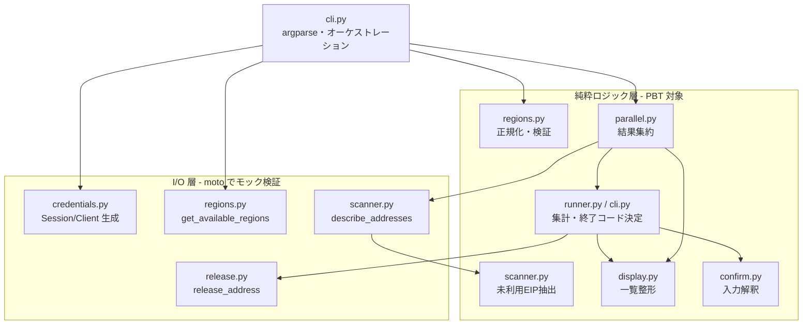
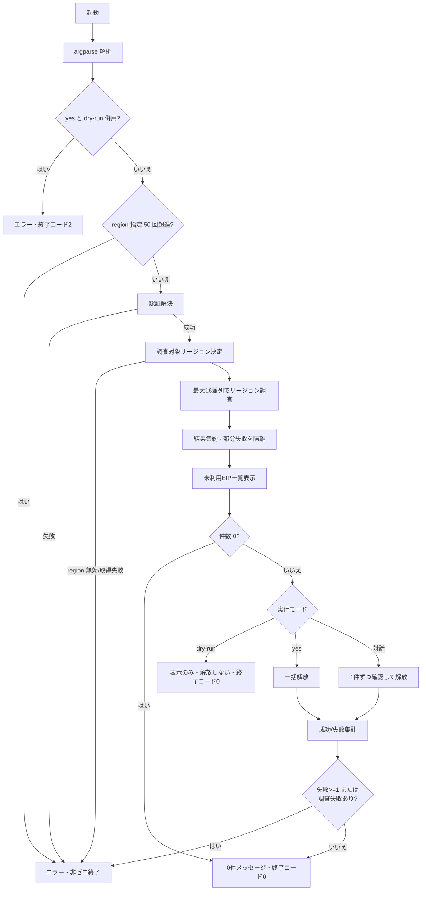

# Design Document

## Overview

aws-eip-cleaner は、AWS アカウント上の未利用 Elastic IP（EIP）を検出・解放する CLI ツールである。ここでの「未利用 EIP」は **`Association ID` を持たない（`Association ID` が未設定または空である）割り当て済み EIP**（いずれの EC2 インスタンス・ENI にも関連付けられていない EIP）と定義する。

本ツールは以下の流れで動作する。

1. `argparse` でコマンドラインオプションを解析する（`--region`, `--profile`, `--dry-run`, `--yes`）。
2. `--yes` と `--dry-run` は排他とし、同時指定はエラー終了する（承認済みの仕様）。
3. boto3 の標準認証チェーンまたは指定プロファイルで認証情報を解決する。
4. 調査対象リージョンを決定する（`--region` 指定時はその集合、無指定時はアクセス可能な全リージョン）。
5. リージョンを最大 16 並列で調査し、各リージョンの未利用 EIP を抽出する。
6. 各リージョンの結果を 1 つの集約結果に統合する（部分失敗は隔離）。
7. 検出した未利用 EIP を一覧表示する。
8. 実行モードに応じて解放を行う（dry-run: 表示のみ / 対話: 1 件ずつ確認 / yes: 一括）。
9. 成功・失敗件数を集計し、終了コードを決定する。

設計方針として、**AWS API に依存する I/O 層**と**純粋なロジック層**を明確に分離する。純粋なロジック層（未利用 EIP の抽出、リージョン正規化・検証、集約、入力解釈、集計・終了コード決定、一覧整形）はプロパティベーステスト（PBT）の対象とし、I/O 層は moto によるモックで検証する。

### 技術スタック

steering（`structure.md` / `python.md`）に厳密準拠する。

- **言語**: Python 3.14、src レイアウト（`aws-eip-cleaner/src/aws_eip_cleaner/`, `aws-eip-cleaner/tests/`）
- **パッケージ/環境管理**: uv（`uv add` / `uv add --dev` / `uv run`）、`pyproject.toml`, `uv.lock`, `README.md`
- **AWS SDK**: boto3、型付けは `boto3-stubs[ec2]`。クライアント型注釈は `mypy_boto3_ec2.client.EC2Client` を使用
- **型ヒント**: 全関数・メソッドの引数・戻り値（`-> None` 含む）に付与。`X | None` / `list[X]` などモダン記法。mypy strict
- **リンタ/フォーマッタ**: Ruff（`ruff format` / `ruff check`、pydocstyle `D` の numpy convention）。docstring は日本語・numpy スタイル
- **ロギング**: 標準 `logging`（`logger = logging.getLogger(__name__)`）。`print` は使用しない（ただしユーザ向け一覧・確認プロンプトなど「アプリの出力」は標準出力/標準エラーへ意図的に書き出す）
- **例外**: 基底例外 `AwsEipCleanerError` を用意し、個別例外はこれを継承。組み込み・ライブラリ例外はツール固有例外に変換して送出
- **テスト**: pytest + Hypothesis（PBT）、boto3 呼び出しは moto でモック

## Architecture

### モジュール構成

```
src/aws_eip_cleaner/
├── __init__.py
├── __main__.py            # python -m aws_eip_cleaner のエントリポイント
├── cli.py                 # 引数解析、オプション検証、全体オーケストレーション、終了コード決定
├── errors.py              # 例外階層（AwsEipCleanerError とその派生）
├── models.py              # データモデル（UnusedEip, RegionScanResult, AggregatedResult, ReleaseSummary 等）
├── credentials.py         # Credential_Resolver: boto3 Session の生成・認証解決
├── regions.py             # リージョン列挙・正規化・検証
├── scanner.py             # Region_Scanner: 単一リージョンの EIP 列挙と未利用抽出
├── parallel.py            # 最大 16 並列の調査実行と結果集約
├── display.py             # 一覧整形・件数表示
├── confirm.py             # Interactive_Confirmation: 入力解釈と 1 件ずつの確認フロー
├── release.py             # 解放処理（Allocation_ID 指定、botocore 標準リトライ設定）
└── runner.py              # 解放オーケストレーション（dry-run / 対話 / yes モードの分岐と集計）
```

### レイヤ分離



### 実行フロー



## Components and Interfaces

各コンポーネントの主要インタフェースを示す（型は Python 3.14 記法）。

### cli.py

```python
def build_parser() -> argparse.ArgumentParser:
    """コマンドライン引数パーサを構築する。"""

def parse_args(argv: list[str] | None = None) -> argparse.Namespace:
    """引数を解析する。未知オプション・不正値は argparse が SystemExit(2) を送出する。"""

def validate_options(args: argparse.Namespace) -> None:
    """オプション間の整合性を検証する。

    --yes と --dry-run の併用は OptionConflictError を送出する。
    --region の指定回数が 50 回を超える場合は TooManyRegionsError を送出する（要件 2.3）。
    重複排除前の指定回数で判定する。
    """

def main(argv: list[str] | None = None) -> int:
    """エントリポイント。終了コードを返す。"""

def determine_exit_code(release_summary: ReleaseSummary, scan_failed: bool) -> int:
    """解放結果と調査失敗の有無から終了コードを決定する（純粋関数, PBT 対象）。"""
```

- **オプション定義**:
  - `--region`（`action="append"`, 複数回指定可, 既定 `[]`。指定回数の上限 50 は `validate_options` で検証する（要件 2.3））
  - `--profile`（`str | None`, 既定 `None`）
  - `--dry-run`（`store_true`, 既定 `False`）
  - `--yes`（`store_true`, 既定 `False`）
- 未知オプション・不正値は argparse の標準挙動で usage を stderr に表示し `SystemExit(2)`。`--help` は stdout に表示し `SystemExit(0)`。

### credentials.py

```python
def resolve_session(profile: str | None) -> Session:
    """認証情報を解決し boto3 Session を返す。

    profile が None なら標準チェーン、指定時はそのプロファイルを使用する。
    ProfileNotFound は ProfileNotFoundError に、認証失敗は CredentialResolutionError に変換する。
    """

def create_ec2_client(session: Session, region: str) -> EC2Client:
    """指定リージョンの型付き EC2 クライアントを生成する。標準リトライ設定を適用する。"""
```

- `create_ec2_client` は `botocore.config.Config(retries={"max_attempts": 3, "mode": "standard"})` を適用する（要件 10.4）。

### regions.py

```python
def normalize_regions(regions: list[str]) -> list[str]:
    """指定リージョンを重複排除して正規化する（純粋関数, PBT 対象）。順序は安定させる。"""

def validate_regions(regions: list[str], available: set[str]) -> None:
    """全リージョンが available に含まれることを検証する（純粋関数, PBT 対象）。

    含まれない値が 1 つでもあれば InvalidRegionError を送出する。
    """

def list_available_regions(session: Session) -> list[str]:
    """アクセス可能な EC2 リージョン一覧を取得する。失敗時 RegionListingError を送出する。"""

def resolve_target_regions(args_regions: list[str], session: Session) -> list[str]:
    """調査対象リージョンを決定する。指定があれば正規化+検証、無指定なら全リージョン。"""
```

### scanner.py

```python
def extract_unused_eips(addresses: list[AddressTypeDef], region: str) -> list[UnusedEip]:
    """describe_addresses の結果から未利用 EIP を抽出する（純粋関数, PBT 対象）。

    AssociationId が未設定または空である各アドレスを UnusedEip として抽出する。
    抽出した各 UnusedEip の association_id は None（関連付けなし）とする。
    """

def scan_region(client: EC2Client, region: str) -> RegionScanResult:
    """単一リージョンを調査する。describe_addresses 失敗時は失敗として RegionScanResult を返す。"""
```

- `scan_region` は API 例外を捕捉し、部分取得結果を破棄して失敗扱いにする（要件 5.5）。

### parallel.py

```python
def compute_max_workers(region_count: int, limit: int = 16) -> int:
    """並列度を決定する（純粋関数）。min(limit, region_count) を返す（region_count>=1 前提）。"""

def scan_regions(
    scan_fn: Callable[[str], RegionScanResult],
    regions: list[str],
) -> AggregatedResult:
    """各リージョンを最大 16 並列で調査し、全完了後に集約する。"""

def aggregate(results: list[RegionScanResult]) -> AggregatedResult:
    """リージョン調査結果を 1 つに集約する（純粋関数, PBT 対象）。成功/失敗を分類する。"""
```

- `ThreadPoolExecutor(max_workers=compute_max_workers(...))` を使用し、`concurrent.futures.as_completed` で全 future の完了を待ってから `aggregate` を呼ぶ（要件 4.1, 4.2, 4.3）。
- 各 future 内の例外は `scan_fn`（= `scan_region`）が失敗結果として返すため、1 リージョンの失敗が他へ波及しない（要件 4.4, 4.5）。

### display.py

```python
def format_eip_list(eips: list[UnusedEip]) -> str:
    """未利用 EIP 一覧を整形する（純粋関数, PBT 対象）。

    各 EIP を Allocation_ID・パブリック IP・リージョン・関連付け状態を含む 1 行として出力し、
    合計件数の行を含める。件数の打ち切りは行わない。関連付け状態は association_id が None なら
    「関連付けなし」を表す文言として整形する（通常モード・dry-run モードで共通の書式）。
    """

def print_eip_list(eips: list[UnusedEip]) -> None:
    """整形した一覧を標準出力へ書き出す。"""
```

### confirm.py

```python
class ConfirmDecision(enum.Enum):
    APPROVE = "approve"
    REJECT = "reject"
    INVALID = "invalid"

def interpret_input(raw: str) -> ConfirmDecision:
    """1 文字入力を解釈する（純粋関数, PBT 対象）。

    'y'/'Y' は APPROVE、'n'/'N' は REJECT、それ以外は INVALID。大文字小文字は区別しない。
    """

def prompt_decision(eip: UnusedEip, input_fn: Callable[[str], str], max_retries: int = 3) -> ConfirmDecision:
    """1 件の EIP について承認/拒否を得る。無効入力は最大 3 回まで再入力を求める。

    EOF（EOFError）を検知した場合は中断を示すため再送出する。
    """
```

- `input_fn` を注入可能にし、テストで擬似入力を渡せるようにする。
- 無効入力が `max_retries` 回連続した場合は REJECT として扱う（要件 8.5）。

### release.py

```python
def release_eip(client: EC2Client, eip: UnusedEip) -> None:
    """EIP を Allocation_ID を用いて解放する。

    リトライ可能エラーは botocore 標準リトライ機構が処理する。
    解放失敗時は EipReleaseError を送出する。
    """
```

### runner.py

```python
def run_dry_run(eips: list[UnusedEip]) -> int:
    """dry-run モード。一覧と総件数を表示し、解放・対話を一切行わない。終了コードを返す。"""

def run_auto_approve(eips: list[UnusedEip], release_fn: Callable[[UnusedEip], None]) -> ReleaseSummary:
    """yes モード。総数を表示し全件を解放、成功/失敗を集計する。部分失敗でも継続する。"""

def run_interactive(
    eips: list[UnusedEip],
    input_fn: Callable[[str], str],
    release_fn: Callable[[UnusedEip], None],
) -> ReleaseSummary:
    """対話モード。1 件ずつ確認し承認分のみ解放、成功/失敗を集計する。EOF で残りを中断する。"""
```

## Data Models

```python
from dataclasses import dataclass, field


@dataclass(frozen=True)
class UnusedEip:
    """未利用 EIP を表す不変データ。

    Attributes
    ----------
    allocation_id : str
        EIP の割り当て ID（eipalloc-xxxx）。
    public_ip : str
        パブリック IPv4 アドレス。
    region : str
        EIP が属するリージョン。
    association_id : str | None
        EIP の関連付け状態を表す Association_ID。未利用 EIP は定義上いずれのリソースにも
        関連付けられていないため常に None（関連付けなし）となる。一覧表示で「関連付け状態」を
        明示するために保持する。
    """

    allocation_id: str
    public_ip: str
    region: str
    association_id: str | None = None


@dataclass(frozen=True)
class RegionScanResult:
    """単一リージョンの調査結果。

    Attributes
    ----------
    region : str
        調査対象リージョン。
    unused_eips : list[UnusedEip]
        検出した未利用 EIP。失敗時は空。
    error : str | None
        調査に失敗した場合のエラー内容。成功時は None。
    """

    region: str
    unused_eips: list[UnusedEip]
    error: str | None = None

    @property
    def succeeded(self) -> bool:
        """調査が成功したかを返す。"""
        return self.error is None


@dataclass(frozen=True)
class AggregatedResult:
    """全リージョンの集約結果。

    Attributes
    ----------
    unused_eips : list[UnusedEip]
        成功したリージョンの未利用 EIP を統合したもの。
    succeeded_regions : list[str]
        調査に成功したリージョン。
    failed_regions : dict[str, str]
        調査に失敗したリージョンとエラー内容の対応。
    """

    unused_eips: list[UnusedEip]
    succeeded_regions: list[str]
    failed_regions: dict[str, str] = field(default_factory=dict)

    @property
    def has_scan_failure(self) -> bool:
        """調査に失敗したリージョンが 1 件以上あるかを返す。"""
        return len(self.failed_regions) > 0


@dataclass(frozen=True)
class ReleaseSummary:
    """解放処理の集計。

    Attributes
    ----------
    succeeded : int
        解放に成功した件数（0 以上）。
    failed : int
        解放に失敗した件数（0 以上）。
    """

    succeeded: int
    failed: int

    @property
    def total(self) -> int:
        """処理した総件数を返す。"""
        return self.succeeded + self.failed
```

## Correctness Properties

*A property is a characteristic or behavior that should hold true across all valid executions of a system—essentially, a formal statement about what the system should do. Properties serve as the bridge between human-readable specifications and machine-verifiable correctness guarantees.*

本ツールの純粋ロジック層は明確な入出力を持ち、入力バリエーションが本質的に意味を持つため PBT を適用する。prework の分析と Property Reflection による統合結果を以下に示す。

### Property 1: リージョン正規化は一意集合と等価かつ冪等

*For any* 有効なリージョン名のリスト（重複を含む）について、`normalize_regions` の結果は入力の一意集合と等しく（集合として等価）、かつ再度正規化しても結果が変わらない（冪等）。

**Validates: Requirements 2.1, 2.3**

### Property 2: リージョン検証は無効値を 1 つでも含めば拒否する

*For any* 利用可能リージョン集合と任意の入力リージョンリストについて、入力の全要素が利用可能集合に含まれる場合に限り `validate_regions` は成功し、含まれない値が 1 つ以上あれば必ず `InvalidRegionError` を送出する。

**Validates: Requirements 2.4**

### Property 3: 未利用 EIP 抽出は Association_ID 非保持の EIP と厳密一致しフィールドを保持する

*For any* `describe_addresses` 相当のアドレス集合（Association_ID の有無が混在）とリージョンについて、`extract_unused_eips` の結果は「AssociationId が未設定または空であるアドレス」の集合と厳密に一致し、抽出した各 `UnusedEip` の `allocation_id`・`public_ip` は元アドレスと、`region` は引数と一致する。アドレスが空なら結果も空になる。

**Validates: Requirements 5.2, 5.3, 5.4**

### Property 4: 集約は全リージョンを漏れなく分類し成功結果の EIP を保持する

*For any* リージョン調査結果のリスト（成功・失敗が混在）について、`aggregate` の結果は、成功リージョン集合と失敗リージョン集合の和が入力の全リージョンに一致し（重複なく分割）、失敗リージョン集合は `error` を持つものと一致し、統合された `unused_eips` は成功リージョンの EIP をすべて（かつそれのみ）含む。

**Validates: Requirements 4.3, 4.4, 4.5**

### Property 5: 一覧整形は全対象を 1 行ずつ全項目付きで表示し件数を含め打ち切らない

*For any* 未利用 EIP のリストについて、`format_eip_list` の出力に含まれる EIP 明細行の数は入力件数と等しく（件数によらず打ち切らない）、各明細行には対応する `allocation_id`・`public_ip`・`region`・関連付け状態がすべて含まれ、出力には合計件数（リスト長）の表示が含まれる。

**Validates: Requirements 6.1, 6.2, 6.4, 6.5, 7.1, 7.4**

### Property 6: 確認入力の解釈は y/n（大小無視）以外をすべて無効とする

*For any* 文字列入力について、`interpret_input` は正規化後（トリム・小文字化）が `"y"` のとき APPROVE、`"n"` のとき REJECT、それ以外はすべて INVALID を返す。

**Validates: Requirements 8.2, 8.3, 8.4**

### Property 7: dry-run では解放も対話も一切発生しない

*For any* 未利用 EIP のリストについて、dry-run モードで実行すると解放関数の呼び出し回数は 0 であり、対話確認も一切行われない。

**Validates: Requirements 7.1, 7.2**

### Property 8: yes モードは全対象に対し解放を 1 回ずつ試行する

*For any* 未利用 EIP のリストについて、yes モードで実行すると各 EIP に対して解放が 1 回ずつ（合計で件数と同数）試行され、対話確認は発生しない。

**Validates: Requirements 9.1**

### Property 9: 解放集計は非負かつ合計整合で、失敗があるときのみ非ゼロ終了する

*For any* 未利用 EIP のリストと、各 EIP に対し成功または失敗を返す解放関数について、集計結果の `succeeded` と `failed` はいずれも 0 以上で、その和は処理件数に等しく、`determine_exit_code` は（調査失敗がない前提で）`failed > 0` のときのみ非ゼロ、`failed == 0` のとき 0 を返す。

**Validates: Requirements 8.8, 9.4, 10.6**

## Error Handling

### 例外階層

```python
class AwsEipCleanerError(Exception):
    """本ツールの基底例外。"""


class OptionConflictError(AwsEipCleanerError):
    """--yes と --dry-run など、両立しないオプションが指定された場合の例外。"""


class TooManyRegionsError(AwsEipCleanerError, ValueError):
    """--region の指定回数が上限（50 回）を超えた場合の例外。"""


class InvalidRegionError(AwsEipCleanerError, ValueError):
    """--region に無効なリージョン名が指定された場合の例外。"""


class RegionListingError(AwsEipCleanerError, RuntimeError):
    """アクセス可能なリージョン一覧の取得に失敗した場合の例外。"""


class ProfileNotFoundError(AwsEipCleanerError):
    """指定された認証プロファイルが見つからない場合の例外。"""


class CredentialResolutionError(AwsEipCleanerError):
    """認証情報の解決に失敗した場合の例外。"""


class RegionScanError(AwsEipCleanerError, RuntimeError):
    """単一リージョンの EIP 列挙に失敗した場合の例外。"""


class EipReleaseError(AwsEipCleanerError, RuntimeError):
    """EIP の解放に失敗した場合の例外。"""
```

- botocore の `ProfileNotFound` → `ProfileNotFoundError`、`NoCredentialsError` / `ClientError`（認証系）→ `CredentialResolutionError`、`describe_addresses` の `ClientError` → `RegionScanError`、`release_address` の `ClientError` → `EipReleaseError` に変換する。組み込み・ライブラリ例外を素通しせず、ツール固有例外へ変換して送出する（steering 準拠）。

### 例外ハンドリングの方針

- **リージョン調査の失敗（`RegionScanError`）**: `scan_region` 内で捕捉し `RegionScanResult(error=...)` に変換。部分取得した EIP は記録しない（要件 5.5）。他リージョンの調査は継続する（要件 4.4）。
- **解放の失敗（`EipReleaseError`）**: `runner` 側で捕捉し、ERROR ログ（Allocation_ID とエラー内容）を出したうえで失敗件数に計上し、残りの対象処理を継続する（要件 8.7, 9.4, 10.3）。
- **リトライ**: `release_address` のリトライ可能エラーは botocore 標準リトライ機構（`max_attempts=3`, `mode="standard"`, 指数バックオフ）に委譲する（要件 10.4）。リトライ不能エラー（`AuthFailure` 等）は botocore が再試行しないため 1 回で失敗確定となる（要件 10.5）。
- **EOF / 中断**: 対話モードで `EOFError` を検知したら残りの EIP を解放せず処理を打ち切る（要件 8.6）。

### 終了コード方針

| 状況 | 終了コード |
| --- | --- |
| 正常完了（解放失敗・調査失敗なし） | 0 |
| 未利用 EIP が 0 件 | 0 |
| dry-run（正常表示） | 0 |
| 未知オプション / 不正値 / `--yes` と `--dry-run` の併用 | 2 |
| `--region` の指定回数が 50 回超過 | 非ゼロ（実装上は 1） |
| 認証失敗 / プロファイル不在 | 非ゼロ（`>=1`, 実装上は 1） |
| リージョン一覧取得失敗 / 無効リージョン指定 | 非ゼロ（実装上は 1） |
| 解放失敗が 1 件以上、または調査失敗リージョンが 1 件以上 | 非ゼロ（実装上は 1） |

`determine_exit_code` が解放集計（`ReleaseSummary`）と調査失敗の有無（`AggregatedResult.has_scan_failure`）から最終終了コードを決定する。argparse 起因の 2 系はパーサ層で `SystemExit(2)` として処理する。

## Testing Strategy

**PBT 適用性の判断**: 本ツールは AWS API を呼ぶ CLI だが、中核ロジック（未利用 EIP 抽出、リージョン正規化・検証、集約、入力解釈、集計・終了コード決定、一覧整形）は純粋関数として切り出せ、「任意の入力 X について性質 P(X) が成り立つ」形で表現できる。したがって PBT を適用する。一方、AWS API 呼び出し・認証解決・リージョン取得・並列実行そのものは外部依存であり、PBT ではなく moto によるモック統合テストと例外系のユニットテストで検証する。

### デュアルテスト方針

- **プロパティテスト（Hypothesis）**: 上記 Correctness Properties 1〜9 を、それぞれ **単一のプロパティテスト**として実装する。各テストは **最低 100 回の反復**を行う（`@settings(max_examples=100)`）。各テストには設計プロパティを参照するコメントを付す。
  - タグ形式: `# Feature: aws-eip-cleaner, Property {番号}: {プロパティ本文}`
  - ライブラリはゼロから実装せず Hypothesis を使用する（`uv add --dev hypothesis`）。
- **ユニットテスト（pytest）**: 具体例・境界・エラー系を対象とする。
  - 引数解析（1.1, 1.5）: 代表的引数列で Namespace / 既定値を確認。
  - 未知オプション・不正値（1.2, 1.4）: `SystemExit(2)` と stderr を確認。
  - `--help`（1.3）: `SystemExit(0)` と stdout のオプション説明を確認。
  - `--yes`/`--dry-run` 併用（9.5）: `OptionConflictError` → 非ゼロ終了・解放未実行。
  - `--region` 指定回数の上限（2.3）: 50 回は受理、51 回で `TooManyRegionsError` → 非ゼロ終了・調査未実行（境界 50/51）。
  - 0 件境界（6.3, 7.3, 9.6）: 各モードで対象なしメッセージ・終了コード 0。
  - プロファイル不在・認証失敗（3.3, 3.4）: 例外変換と非ゼロ終了。
  - EOF 中断（8.6）: 擬似入力で残りが解放されないこと。
  - 再入力上限（8.1, 8.5）: 無効入力 3 連続で拒否として次へ。
  - 並列度（4.1）: `compute_max_workers` が `min(16, n)` を返すこと（境界 n=1, 15, 16, 17）。
  - リトライ設定（10.4）: 生成 Config の `retries` が `{"max_attempts": 3, "mode": "standard"}`。
  - ログ出力（10.2, 10.3）: `caplog` で INFO/ERROR に Allocation_ID が含まれること。
- **moto によるモック統合テスト**: AWS 依存部分を検証する。
  - リージョン列挙（2.2, 2.5, 5.1）: `get_available_regions` のモック、失敗時の非ゼロ終了。
  - EIP 列挙・解放（5.1, 10.1, 10.5）: moto で EIP を割り当て、`describe_addresses` の全件列挙、`release_address` が Allocation_ID 指定で行われること、リトライ不能エラーで 1 回で失敗すること。
  - 認証成功（3.1, 3.2, 3.5）: profile 有無で Session 生成引数が切り替わり、クライアント生成が成功すること。

### PBT の入力生成方針

- Hypothesis のストラテジで `UnusedEip`（allocation_id は `eipalloc-` + 英数、public_ip は IPv4 文字列、region は有効リージョン名）を生成する。
- アドレス集合は `AssociationId` の有無・空文字を織り交ぜて生成し、抽出プロパティの網羅性を高める。
- リージョンリストは重複・順序ばらつきを含めて生成し、正規化・検証プロパティを検証する。
- 確認入力は任意 Unicode 文字列を生成し、`interpret_input` の分類プロパティを検証する（特殊文字・空文字・空白を含む）。
- 解放関数はランダムに成功/失敗を返すモックとして注入し、集計・終了コードプロパティを検証する。

## Requirements Traceability

各要件を、設計上のコンポーネント・プロパティ・テストへ対応付ける。

| 要件 | 受入基準 | 対応コンポーネント | 検証手段 |
| --- | --- | --- | --- |
| 1. オプション解析 | 1.1–1.5 | `cli.build_parser` / `parse_args` | ユニット（argparse 挙動・既定値・SystemExit 2/0） |
| 2. リージョン指定 | 2.1, 2.3（重複統合） | `regions.normalize_regions` | Property 1 |
| | 2.3（上限 50 の検証） | `cli.validate_options`（上限検証） | ユニット（境界 50/51・TooManyRegionsError・非ゼロ終了） |
| | 2.4 | `regions.validate_regions` | Property 2 |
| | 2.2, 2.5 | `regions.list_available_regions` / `resolve_target_regions` | moto モック・例外ユニット |
| 3. 認証解決 | 3.1, 3.2, 3.5 | `credentials.resolve_session` / `create_ec2_client` | moto モック統合 |
| | 3.3, 3.4 | 同上（例外変換） | ユニット（例外系・非ゼロ終了） |
| 4. 並列調査 | 4.1 | `parallel.compute_max_workers` | ユニット（境界 1/15/16/17） |
| | 4.2 | `parallel.scan_regions`（全 future 待機） | ユニット |
| | 4.3, 4.4, 4.5 | `parallel.aggregate` | Property 4 |
| 5. 未利用検出 | 5.2, 5.3, 5.4 | `scanner.extract_unused_eips` | Property 3 |
| | 5.1 | `scanner.scan_region`（列挙） | moto モック統合 |
| | 5.5 | `scanner.scan_region`（失敗隔離） | ユニット（API 例外→失敗扱い） |
| 6. 一覧表示 | 6.1, 6.2, 6.4, 6.5 | `display.format_eip_list` | Property 5 |
| | 6.3 | `cli` / `runner`（0 件分岐） | ユニット（0 件境界） |
| 7. dry-run | 7.1, 7.2 | `runner.run_dry_run` | Property 7 |
| | 7.4 | `display.format_eip_list`（件数表示） | Property 5 |
| | 7.3 | `runner.run_dry_run`（0 件） | ユニット |
| 8. 対話確認 | 8.2, 8.3, 8.4 | `confirm.interpret_input` | Property 6 |
| | 8.1, 8.5 | `confirm.prompt_decision` | ユニット（再入力上限 3） |
| | 8.6 | `runner.run_interactive`（EOF） | ユニット |
| | 8.7 | `runner.run_interactive`（失敗継続） | ユニット |
| | 8.8 | `cli.determine_exit_code` | Property 9 |
| 9. 一括削除 | 9.1 | `runner.run_auto_approve` | Property 8 |
| | 9.4 | `runner.run_auto_approve` / `determine_exit_code` | Property 9 |
| | 9.2, 9.3 | `runner.run_auto_approve`（件数表示） | ユニット |
| | 9.5 | `cli.validate_options`（排他） | ユニット（併用エラー・非ゼロ終了） |
| | 9.6 | `runner.run_auto_approve`（0 件） | ユニット |
| 10. 解放処理 | 10.6 | `runner` 集計 / `determine_exit_code` | Property 9 |
| | 10.1, 10.5 | `release.release_eip` | moto モック統合 |
| | 10.2, 10.3 | `release` / `runner`（ログ） | ユニット（caplog） |
| | 10.4 | `credentials.create_ec2_client`（Config） | ユニット（retries 設定） |

すべての要件（1〜10）が、いずれかのコンポーネントとプロパティまたはユニット/統合テストにマッピングされている。
